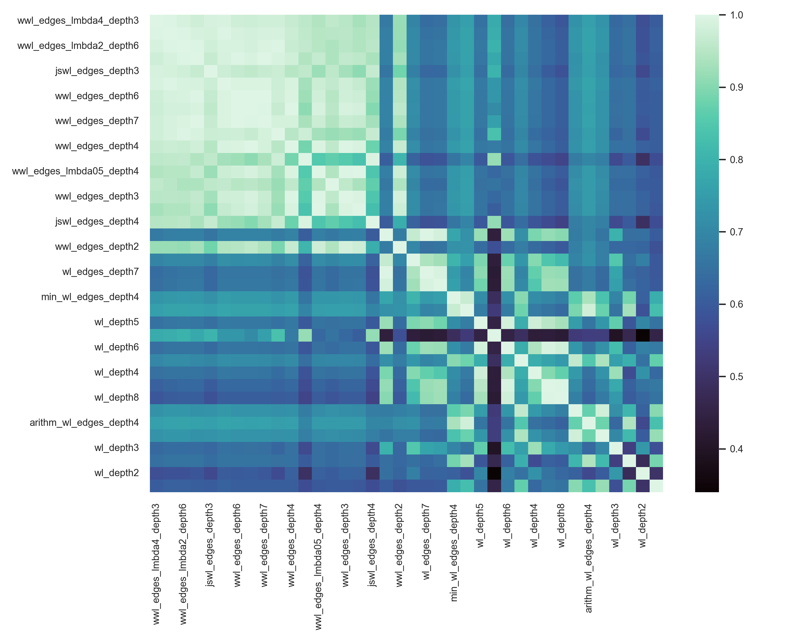

# Results
## Ranking
| Method                                                  |   Accuracy |   Precision |   Recall |   F1 |   ROCAUC |
|:--------------------------------------------------------|-----------:|------------:|---------:|-----:|---------:|
| [wwl_edges_lmbda2_depth6](#wwl_edges_lmbda2_depth6)     |       93.4 |        88.6 |     32.7 | 47.5 |     91.7 |
| [wwl_edges_depth8](#wwl_edges_depth8)                   |       92.6 |        91.5 |     21.9 | 35.2 |     91.7 |
| [jswl_edges_depth3](#jswl_edges_depth3)                 |       93.6 |        84.1 |     37.4 | 51.7 |     91.6 |
| [wwl_edges_lmbda2_depth4](#wwl_edges_lmbda2_depth4)     |       93.6 |        85.6 |     36.2 | 50.7 |     91.6 |
| [wwl_edges_lmbda4_depth4](#wwl_edges_lmbda4_depth4)     |       93.4 |        86.4 |     34.7 | 49.4 |     91.6 |
| [wwl_edges_depth6](#wwl_edges_depth6)                   |       92.9 |        90.6 |     26.2 | 40.5 |     91.6 |
| [wwl_edges_depth5](#wwl_edges_depth5)                   |       93.1 |        90.5 |     28.2 | 42.9 |     91.5 |
| [wwl_edges_depth7](#wwl_edges_depth7)                   |       92.8 |        91.7 |     24   | 37.9 |     91.5 |
| [wwl_edges_lmbda2_depth8](#wwl_edges_lmbda2_depth8)     |       93.2 |        90   |     30.4 | 45.3 |     91.4 |
| [wwl_edges_depth4](#wwl_edges_depth4)                   |       93.1 |        87.8 |     28.9 | 43.3 |     91.3 |
| [wwl_edges_lmbda05_depth4](#wwl_edges_lmbda05_depth4)   |       91.8 |        93.4 |     12.5 | 22.1 |     91   |
| [wwl_edges_depth3](#wwl_edges_depth3)                   |       93.1 |        87.6 |     29.9 | 44.5 |     90.9 |
| [wwl_edges_lmbda01_depth4](#wwl_edges_lmbda01_depth4)   |       90.8 |         0   |      0   |  0   |     90.8 |
| [jswl_edges_depth4](#jswl_edges_depth4)                 |       93   |        85.7 |     29.6 | 43.9 |     90.7 |
| [wl_edges_depth6](#wl_edges_depth6)                     |       93   |        64   |     55.1 | 59.2 |     90.3 |
| [wwl_edges_depth2](#wwl_edges_depth2)                   |       92.9 |        89   |     26.1 | 40.3 |     90.3 |
| [wl_edges_depth4](#wl_edges_depth4)                     |       93   |        63.7 |     57.1 | 60   |     90.2 |
| [wl_edges_depth7](#wl_edges_depth7)                     |       88.7 |        57.6 |     62.3 | 56   |     90.2 |
| [wl_edges_depth8](#wl_edges_depth8)                     |       92.8 |        63   |     54.4 | 58.3 |     90   |
| [min_wl_edges_depth4](#min_wl_edges_depth4)             |       93.2 |        64.9 |     57.8 | 61   |     89.7 |
| [minmax_wl_edges_depth4](#minmax_wl_edges_depth4)       |       93.3 |        67.1 |     54   | 59.8 |     89.3 |
| [wl_depth5](#wl_depth5)                                 |       92.6 |        61.1 |     58   | 59.1 |     89.3 |
| [wwl_edges_lmbda10_depth4](#wwl_edges_lmbda10_depth4)   |       92.5 |        84.2 |     22.6 | 35.5 |     89.2 |
| [wl_depth6](#wl_depth6)                                 |       92.7 |        62.9 |     52.3 | 57   |     89.1 |
| [min_wl_depth4](#min_wl_depth4)                         |       93.1 |        65.2 |     55   | 59.6 |     89   |
| [wl_depth4](#wl_depth4)                                 |       91.3 |        55.1 |     64.5 | 58   |     89   |
| [wl_depth7](#wl_depth7)                                 |       92.6 |        62.1 |     52   | 56.5 |     89   |
| [wl_depth8](#wl_depth8)                                 |       89.5 |        55.8 |     56.4 | 53.1 |     88.8 |
| [minmax_wl_depth4](#minmax_wl_depth4)                   |       93.2 |        66.4 |     53.9 | 59.5 |     88.7 |
| [arithm_wl_edges_depth4](#arithm_wl_edges_depth4)       |       93.4 |        67.7 |     54.3 | 60.3 |     88.5 |
| [arithm_wl_depth4](#arithm_wl_depth4)                   |       93   |        65   |     52.4 | 58   |     88   |
| [wl_depth3](#wl_depth3)                                 |       65.6 |        26.2 |     84.9 | 36.2 |     87.2 |
| [invminmax_wl_edges_depth4](#invminmax_wl_edges_depth4) |       81   |        43.9 |     65.5 | 46.6 |     86.7 |
| [wl_depth2](#wl_depth2)                                 |       77.4 |        32.9 |     75.4 | 44.2 |     85.9 |
| [invminmax_wl_depth4](#invminmax_wl_depth4)             |       91.6 |        54.5 |     51.2 | 52.7 |     85.7 |
## Correlation between methods

## arithm_wl_depth4
|         | Accuracy   | Precision   | Recall   | F1    | ROCAUC   |
|:--------|:-----------|:------------|:---------|:------|:---------|
| Fold 1  | 94.0%      | 61.3%       | 51.4%    | 55.9% | 86.8%    |
| Fold 2  | 91.9%      | 65.9%       | 51.9%    | 58.0% | 88.2%    |
| Fold 3  | 93.3%      | 63.2%       | 50.6%    | 56.2% | 87.1%    |
| Fold 4  | 92.0%      | 65.9%       | 52.3%    | 58.3% | 88.0%    |
| Fold 5  | 94.1%      | 70.1%       | 60.0%    | 64.7% | 87.4%    |
| Fold 6  | 92.8%      | 63.8%       | 48.4%    | 55.0% | 90.7%    |
| Average | 93.0%      | 65.0%       | 52.4%    | 58.0% | 88.0%    |
## arithm_wl_edges_depth4
|         | Accuracy   | Precision   | Recall   | F1    | ROCAUC   |
|:--------|:-----------|:------------|:---------|:------|:---------|
| Fold 1  | 94.5%      | 65.6%       | 54.1%    | 59.3% | 87.6%    |
| Fold 2  | 92.9%      | 70.8%       | 58.3%    | 64.0% | 90.7%    |
| Fold 3  | 93.8%      | 66.7%       | 54.1%    | 59.7% | 89.6%    |
| Fold 4  | 92.6%      | 70.9%       | 52.3%    | 60.2% | 87.3%    |
| Fold 5  | 94.1%      | 71.2%       | 57.8%    | 63.8% | 87.7%    |
| Fold 6  | 92.5%      | 60.8%       | 49.5%    | 54.5% | 88.3%    |
| Average | 93.4%      | 67.7%       | 54.3%    | 60.3% | 88.5%    |
## invminmax_wl_depth4
|         | Accuracy   | Precision   | Recall   | F1    | ROCAUC   |
|:--------|:-----------|:------------|:---------|:------|:---------|
| Fold 1  | 92.2%      | 47.4%       | 50.0%    | 48.7% | 84.0%    |
| Fold 2  | 90.7%      | 57.9%       | 50.9%    | 54.2% | 85.2%    |
| Fold 3  | 92.1%      | 53.8%       | 49.4%    | 51.5% | 86.0%    |
| Fold 4  | 90.4%      | 55.7%       | 50.5%    | 52.9% | 85.8%    |
| Fold 5  | 92.5%      | 58.6%       | 56.7%    | 57.6% | 87.5%    |
| Fold 6  | 91.5%      | 53.6%       | 49.5%    | 51.4% | 85.9%    |
| Average | 91.6%      | 54.5%       | 51.2%    | 52.7% | 85.7%    |
## invminmax_wl_edges_depth4
|         | Accuracy   | Precision   | Recall   | F1    | ROCAUC   |
|:--------|:-----------|:------------|:---------|:------|:---------|
| Fold 1  | 92.9%      | 51.9%       | 55.4%    | 53.6% | 84.0%    |
| Fold 2  | 91.1%      | 60.2%       | 51.9%    | 55.7% | 89.2%    |
| Fold 3  | 56.5%      | 15.4%       | 91.8%    | 26.4% | 88.6%    |
| Fold 4  | 61.0%      | 19.8%       | 86.9%    | 32.3% | 84.5%    |
| Fold 5  | 93.0%      | 62.2%       | 56.7%    | 59.3% | 88.2%    |
| Fold 6  | 91.6%      | 54.1%       | 50.5%    | 52.3% | 85.7%    |
| Average | 81.0%      | 43.9%       | 65.5%    | 46.6% | 86.7%    |
## jswl_edges_depth3
|         | Accuracy   | Precision   | Recall   | F1    | ROCAUC   |
|:--------|:-----------|:------------|:---------|:------|:---------|
| Fold 1  | 94.5%      | 78.8%       | 35.1%    | 48.6% | 91.2%    |
| Fold 2  | 92.4%      | 80.8%       | 38.9%    | 52.5% | 92.2%    |
| Fold 3  | 94.3%      | 83.3%       | 41.2%    | 55.1% | 92.4%    |
| Fold 4  | 92.7%      | 87.0%       | 37.4%    | 52.3% | 91.0%    |
| Fold 5  | 94.5%      | 94.9%       | 41.1%    | 57.4% | 90.3%    |
| Fold 6  | 93.0%      | 80.0%       | 30.8%    | 44.4% | 92.5%    |
| Average | 93.6%      | 84.1%       | 37.4%    | 51.7% | 91.6%    |
## jswl_edges_depth4
|         | Accuracy   | Precision   | Recall   | F1    | ROCAUC   |
|:--------|:-----------|:------------|:---------|:------|:---------|
| Fold 1  | 94.4%      | 82.1%       | 31.1%    | 45.1% | 90.9%    |
| Fold 2  | 92.0%      | 83.3%       | 32.4%    | 46.7% | 91.4%    |
| Fold 3  | 94.1%      | 90.6%       | 34.1%    | 49.6% | 92.3%    |
| Fold 4  | 91.9%      | 90.6%       | 27.1%    | 41.7% | 89.8%    |
| Fold 5  | 93.5%      | 90.3%       | 31.1%    | 46.3% | 88.8%    |
| Fold 6  | 92.3%      | 76.9%       | 22.0%    | 34.2% | 91.1%    |
| Average | 93.0%      | 85.7%       | 29.6%    | 43.9% | 90.7%    |
## min_wl_depth4
|         | Accuracy   | Precision   | Recall   | F1    | ROCAUC   |
|:--------|:-----------|:------------|:---------|:------|:---------|
| Fold 1  | 94.4%      | 62.5%       | 60.8%    | 61.6% | 87.5%    |
| Fold 2  | 91.8%      | 64.8%       | 52.8%    | 58.2% | 89.6%    |
| Fold 3  | 93.5%      | 63.9%       | 54.1%    | 58.6% | 88.8%    |
| Fold 4  | 92.1%      | 65.6%       | 55.1%    | 59.9% | 88.8%    |
| Fold 5  | 93.9%      | 69.3%       | 57.8%    | 63.0% | 88.5%    |
| Fold 6  | 93.0%      | 65.2%       | 49.5%    | 56.2% | 91.1%    |
| Average | 93.1%      | 65.2%       | 55.0%    | 59.6% | 89.0%    |
## min_wl_edges_depth4
|         | Accuracy   | Precision   | Recall   | F1    | ROCAUC   |
|:--------|:-----------|:------------|:---------|:------|:---------|
| Fold 1  | 94.8%      | 66.2%       | 60.8%    | 63.4% | 89.2%    |
| Fold 2  | 92.6%      | 67.7%       | 60.2%    | 63.7% | 91.1%    |
| Fold 3  | 93.7%      | 65.7%       | 54.1%    | 59.4% | 90.6%    |
| Fold 4  | 92.2%      | 67.5%       | 52.3%    | 58.9% | 87.5%    |
| Fold 5  | 92.8%      | 59.2%       | 64.4%    | 61.7% | 89.6%    |
| Fold 6  | 93.0%      | 63.3%       | 54.9%    | 58.8% | 90.0%    |
| Average | 93.2%      | 64.9%       | 57.8%    | 61.0% | 89.7%    |
## minmax_wl_depth4
|         | Accuracy   | Precision   | Recall   | F1    | ROCAUC   |
|:--------|:-----------|:------------|:---------|:------|:---------|
| Fold 1  | 94.4%      | 64.1%       | 55.4%    | 59.4% | 87.2%    |
| Fold 2  | 92.7%      | 70.6%       | 55.6%    | 62.2% | 88.5%    |
| Fold 3  | 93.4%      | 63.4%       | 52.9%    | 57.7% | 88.0%    |
| Fold 4  | 92.0%      | 65.9%       | 52.3%    | 58.3% | 89.0%    |
| Fold 5  | 94.2%      | 71.1%       | 60.0%    | 65.1% | 88.1%    |
| Fold 6  | 92.7%      | 63.2%       | 47.3%    | 54.1% | 91.4%    |
| Average | 93.2%      | 66.4%       | 53.9%    | 59.5% | 88.7%    |
## minmax_wl_edges_depth4
|         | Accuracy   | Precision   | Recall   | F1    | ROCAUC   |
|:--------|:-----------|:------------|:---------|:------|:---------|
| Fold 1  | 94.7%      | 66.7%       | 56.8%    | 61.3% | 88.8%    |
| Fold 2  | 92.4%      | 67.8%       | 56.5%    | 61.6% | 90.5%    |
| Fold 3  | 93.8%      | 66.7%       | 54.1%    | 59.7% | 90.0%    |
| Fold 4  | 92.3%      | 69.7%       | 49.5%    | 57.9% | 88.3%    |
| Fold 5  | 94.2%      | 72.9%       | 56.7%    | 63.7% | 88.7%    |
| Fold 6  | 92.3%      | 59.0%       | 50.5%    | 54.4% | 89.3%    |
| Average | 93.3%      | 67.1%       | 54.0%    | 59.8% | 89.3%    |
## wl_depth2
|         | Accuracy   | Precision   | Recall   | F1    | ROCAUC   |
|:--------|:-----------|:------------|:---------|:------|:---------|
| Fold 1  | 89.8%      | 38.7%       | 64.9%    | 48.5% | 84.9%    |
| Fold 2  | 82.0%      | 35.2%       | 79.6%    | 48.9% | 87.3%    |
| Fold 3  | 86.0%      | 35.0%       | 75.3%    | 47.8% | 88.1%    |
| Fold 4  | 86.6%      | 42.7%       | 73.8%    | 54.1% | 86.6%    |
| Fold 5  | 85.6%      | 34.5%       | 66.7%    | 45.5% | 83.0%    |
| Fold 6  | 34.3%      | 11.4%       | 92.3%    | 20.4% | 85.4%    |
| Average | 77.4%      | 32.9%       | 75.4%    | 44.2% | 85.9%    |
## wl_depth3
|         | Accuracy   | Precision   | Recall   | F1    | ROCAUC   |
|:--------|:-----------|:------------|:---------|:------|:---------|
| Fold 1  | 94.9%      | 65.3%       | 66.2%    | 65.8% | 88.1%    |
| Fold 2  | 72.6%      | 26.6%       | 87.0%    | 40.7% | 88.6%    |
| Fold 3  | 59.5%      | 15.8%       | 87.1%    | 26.8% | 86.9%    |
| Fold 4  | 58.4%      | 19.0%       | 88.8%    | 31.4% | 86.6%    |
| Fold 5  | 50.8%      | 14.5%       | 91.1%    | 25.0% | 86.0%    |
| Fold 6  | 57.1%      | 16.2%       | 89.0%    | 27.4% | 86.8%    |
| Average | 65.6%      | 26.2%       | 84.9%    | 36.2% | 87.2%    |
## wl_depth4
|         | Accuracy   | Precision   | Recall   | F1    | ROCAUC   |
|:--------|:-----------|:------------|:---------|:------|:---------|
| Fold 1  | 93.0%      | 52.2%       | 64.9%    | 57.8% | 88.2%    |
| Fold 2  | 88.3%      | 47.3%       | 74.1%    | 57.8% | 89.4%    |
| Fold 3  | 88.2%      | 40.0%       | 77.6%    | 52.8% | 89.5%    |
| Fold 4  | 92.1%      | 65.9%       | 54.2%    | 59.5% | 88.0%    |
| Fold 5  | 93.1%      | 64.0%       | 53.3%    | 58.2% | 87.9%    |
| Fold 6  | 93.0%      | 61.3%       | 62.6%    | 62.0% | 90.8%    |
| Average | 91.3%      | 55.1%       | 64.5%    | 58.0% | 89.0%    |
## wl_depth5
|         | Accuracy   | Precision   | Recall   | F1    | ROCAUC   |
|:--------|:-----------|:------------|:---------|:------|:---------|
| Fold 1  | 93.8%      | 58.8%       | 54.1%    | 56.3% | 88.3%    |
| Fold 2  | 89.9%      | 52.6%       | 66.7%    | 58.8% | 89.7%    |
| Fold 3  | 93.5%      | 62.5%       | 58.8%    | 60.6% | 90.5%    |
| Fold 4  | 92.1%      | 67.1%       | 51.4%    | 58.2% | 87.3%    |
| Fold 5  | 92.9%      | 62.3%       | 53.3%    | 57.5% | 88.3%    |
| Fold 6  | 93.3%      | 63.0%       | 63.7%    | 63.4% | 91.3%    |
| Average | 92.6%      | 61.1%       | 58.0%    | 59.1% | 89.3%    |
## wl_depth6
|         | Accuracy   | Precision   | Recall   | F1    | ROCAUC   |
|:--------|:-----------|:------------|:---------|:------|:---------|
| Fold 1  | 94.2%      | 61.4%       | 58.1%    | 59.7% | 87.9%    |
| Fold 2  | 91.1%      | 61.2%       | 48.1%    | 53.9% | 89.5%    |
| Fold 3  | 93.3%      | 62.5%       | 52.9%    | 57.3% | 90.6%    |
| Fold 4  | 91.8%      | 65.1%       | 50.5%    | 56.8% | 86.5%    |
| Fold 5  | 93.2%      | 64.9%       | 53.3%    | 58.5% | 88.7%    |
| Fold 6  | 92.7%      | 62.2%       | 50.5%    | 55.8% | 91.2%    |
| Average | 92.7%      | 62.9%       | 52.3%    | 57.0% | 89.1%    |
## wl_depth7
|         | Accuracy   | Precision   | Recall   | F1    | ROCAUC   |
|:--------|:-----------|:------------|:---------|:------|:---------|
| Fold 1  | 93.9%      | 58.7%       | 59.5%    | 59.1% | 87.4%    |
| Fold 2  | 90.9%      | 59.8%       | 48.1%    | 53.3% | 89.5%    |
| Fold 3  | 93.3%      | 63.2%       | 50.6%    | 56.2% | 90.6%    |
| Fold 4  | 90.8%      | 58.6%       | 47.7%    | 52.6% | 86.1%    |
| Fold 5  | 93.6%      | 68.6%       | 53.3%    | 60.0% | 89.0%    |
| Fold 6  | 93.0%      | 64.0%       | 52.7%    | 57.8% | 91.1%    |
| Average | 92.6%      | 62.1%       | 52.0%    | 56.5% | 89.0%    |
## wl_depth8
|         | Accuracy   | Precision   | Recall   | F1    | ROCAUC   |
|:--------|:-----------|:------------|:---------|:------|:---------|
| Fold 1  | 93.9%      | 61.0%       | 48.6%    | 54.1% | 87.0%    |
| Fold 2  | 73.7%      | 27.3%       | 86.1%    | 41.4% | 89.2%    |
| Fold 3  | 93.1%      | 61.4%       | 50.6%    | 55.5% | 90.5%    |
| Fold 4  | 89.8%      | 52.6%       | 46.7%    | 49.5% | 85.9%    |
| Fold 5  | 93.6%      | 68.6%       | 53.3%    | 60.0% | 89.2%    |
| Fold 6  | 93.0%      | 64.0%       | 52.7%    | 57.8% | 90.9%    |
| Average | 89.5%      | 55.8%       | 56.4%    | 53.1% | 88.8%    |
## wl_edges_depth4
|         | Accuracy   | Precision   | Recall   | F1    | ROCAUC   |
|:--------|:-----------|:------------|:---------|:------|:---------|
| Fold 1  | 93.5%      | 55.4%       | 62.2%    | 58.6% | 90.8%    |
| Fold 2  | 91.6%      | 62.2%       | 56.5%    | 59.2% | 89.8%    |
| Fold 3  | 94.1%      | 67.1%       | 60.0%    | 63.4% | 91.9%    |
| Fold 4  | 92.7%      | 71.8%       | 52.3%    | 60.5% | 88.2%    |
| Fold 5  | 92.9%      | 62.0%       | 54.4%    | 58.0% | 89.8%    |
| Fold 6  | 93.1%      | 63.4%       | 57.1%    | 60.1% | 90.4%    |
| Average | 93.0%      | 63.7%       | 57.1%    | 60.0% | 90.2%    |
## wl_edges_depth6
|         | Accuracy   | Precision   | Recall   | F1    | ROCAUC   |
|:--------|:-----------|:------------|:---------|:------|:---------|
| Fold 1  | 94.6%      | 64.7%       | 59.5%    | 62.0% | 90.2%    |
| Fold 2  | 91.4%      | 62.0%       | 52.8%    | 57.0% | 89.9%    |
| Fold 3  | 93.7%      | 64.1%       | 58.8%    | 61.3% | 92.9%    |
| Fold 4  | 91.1%      | 61.3%       | 45.8%    | 52.4% | 87.0%    |
| Fold 5  | 93.5%      | 67.1%       | 54.4%    | 60.1% | 90.9%    |
| Fold 6  | 93.4%      | 65.1%       | 59.3%    | 62.1% | 91.2%    |
| Average | 93.0%      | 64.0%       | 55.1%    | 59.2% | 90.3%    |
## wl_edges_depth7
|         | Accuracy   | Precision   | Recall   | F1    | ROCAUC   |
|:--------|:-----------|:------------|:---------|:------|:---------|
| Fold 1  | 94.8%      | 65.3%       | 63.5%    | 64.4% | 89.8%    |
| Fold 2  | 66.2%      | 23.5%       | 94.4%    | 37.6% | 90.0%    |
| Fold 3  | 93.3%      | 61.3%       | 57.6%    | 59.4% | 92.9%    |
| Fold 4  | 91.0%      | 60.2%       | 46.7%    | 52.6% | 86.3%    |
| Fold 5  | 93.7%      | 70.1%       | 52.2%    | 59.9% | 91.2%    |
| Fold 6  | 93.4%      | 65.1%       | 59.3%    | 62.1% | 91.1%    |
| Average | 88.7%      | 57.6%       | 62.3%    | 56.0% | 90.2%    |
## wl_edges_depth8
|         | Accuracy   | Precision   | Recall   | F1    | ROCAUC   |
|:--------|:-----------|:------------|:---------|:------|:---------|
| Fold 1  | 94.7%      | 64.4%       | 63.5%    | 63.9% | 89.4%    |
| Fold 2  | 91.0%      | 60.2%       | 49.1%    | 54.1% | 89.9%    |
| Fold 3  | 93.3%      | 61.3%       | 57.6%    | 59.4% | 92.5%    |
| Fold 4  | 90.5%      | 57.1%       | 44.9%    | 50.3% | 86.0%    |
| Fold 5  | 93.7%      | 69.6%       | 53.3%    | 60.4% | 91.5%    |
| Fold 6  | 93.4%      | 65.4%       | 58.2%    | 61.6% | 90.9%    |
| Average | 92.8%      | 63.0%       | 54.4%    | 58.3% | 90.0%    |
## wwl_edges_depth2
|         | Accuracy   | Precision   | Recall   | F1    | ROCAUC   |
|:--------|:-----------|:------------|:---------|:------|:---------|
| Fold 1  | 94.0%      | 81.8%       | 24.3%    | 37.5% | 89.3%    |
| Fold 2  | 92.2%      | 94.1%       | 29.6%    | 45.1% | 91.6%    |
| Fold 3  | 93.7%      | 92.3%       | 28.2%    | 43.2% | 90.8%    |
| Fold 4  | 92.0%      | 90.9%       | 28.0%    | 42.9% | 91.2%    |
| Fold 5  | 93.0%      | 91.7%       | 24.4%    | 38.6% | 89.0%    |
| Fold 6  | 92.5%      | 83.3%       | 22.0%    | 34.8% | 89.5%    |
| Average | 92.9%      | 89.0%       | 26.1%    | 40.3% | 90.3%    |
## wwl_edges_depth3
|         | Accuracy   | Precision   | Recall   | F1    | ROCAUC   |
|:--------|:-----------|:------------|:---------|:------|:---------|
| Fold 1  | 94.3%      | 81.5%       | 29.7%    | 43.6% | 90.0%    |
| Fold 2  | 92.4%      | 88.1%       | 34.3%    | 49.3% | 91.7%    |
| Fold 3  | 94.0%      | 93.1%       | 31.8%    | 47.4% | 91.6%    |
| Fold 4  | 92.4%      | 89.7%       | 32.7%    | 47.9% | 91.6%    |
| Fold 5  | 93.3%      | 92.6%       | 27.8%    | 42.7% | 90.0%    |
| Fold 6  | 92.5%      | 80.8%       | 23.1%    | 35.9% | 90.5%    |
| Average | 93.1%      | 87.6%       | 29.9%    | 44.5% | 90.9%    |
## wwl_edges_depth4
|         | Accuracy   | Precision   | Recall   | F1    | ROCAUC   |
|:--------|:-----------|:------------|:---------|:------|:---------|
| Fold 1  | 94.3%      | 79.3%       | 31.1%    | 44.7% | 90.6%    |
| Fold 2  | 92.3%      | 87.8%       | 33.3%    | 48.3% | 92.0%    |
| Fold 3  | 94.0%      | 96.3%       | 30.6%    | 46.4% | 92.0%    |
| Fold 4  | 92.2%      | 89.2%       | 30.8%    | 45.8% | 91.6%    |
| Fold 5  | 93.3%      | 92.6%       | 27.8%    | 42.7% | 90.5%    |
| Fold 6  | 92.3%      | 81.8%       | 19.8%    | 31.9% | 90.9%    |
| Average | 93.1%      | 87.8%       | 28.9%    | 43.3% | 91.3%    |
## wwl_edges_depth5
|         | Accuracy   | Precision   | Recall   | F1    | ROCAUC   |
|:--------|:-----------|:------------|:---------|:------|:---------|
| Fold 1  | 94.4%      | 84.6%       | 29.7%    | 44.0% | 90.7%    |
| Fold 2  | 92.3%      | 89.7%       | 32.4%    | 47.6% | 92.4%    |
| Fold 3  | 93.7%      | 95.8%       | 27.1%    | 42.2% | 92.5%    |
| Fold 4  | 92.6%      | 94.6%       | 32.7%    | 48.6% | 91.4%    |
| Fold 5  | 93.4%      | 96.2%       | 27.8%    | 43.1% | 90.8%    |
| Fold 6  | 92.3%      | 81.8%       | 19.8%    | 31.9% | 91.0%    |
| Average | 93.1%      | 90.5%       | 28.2%    | 42.9% | 91.5%    |
## wwl_edges_depth6
|         | Accuracy   | Precision   | Recall   | F1    | ROCAUC   |
|:--------|:-----------|:------------|:---------|:------|:---------|
| Fold 1  | 94.2%      | 83.3%       | 27.0%    | 40.8% | 90.8%    |
| Fold 2  | 92.0%      | 88.9%       | 29.6%    | 44.4% | 92.6%    |
| Fold 3  | 93.8%      | 96.0%       | 28.2%    | 43.6% | 92.7%    |
| Fold 4  | 92.2%      | 93.9%       | 29.0%    | 44.3% | 91.2%    |
| Fold 5  | 93.0%      | 95.5%       | 23.3%    | 37.5% | 91.2%    |
| Fold 6  | 92.4%      | 85.7%       | 19.8%    | 32.1% | 90.9%    |
| Average | 92.9%      | 90.6%       | 26.2%    | 40.5% | 91.6%    |
## wwl_edges_depth7
|         | Accuracy   | Precision   | Recall   | F1    | ROCAUC   |
|:--------|:-----------|:------------|:---------|:------|:---------|
| Fold 1  | 94.3%      | 87.0%       | 27.0%    | 41.2% | 90.6%    |
| Fold 2  | 91.6%      | 87.5%       | 25.9%    | 40.0% | 92.7%    |
| Fold 3  | 93.7%      | 95.8%       | 27.1%    | 42.2% | 92.8%    |
| Fold 4  | 91.8%      | 96.3%       | 24.3%    | 38.8% | 91.2%    |
| Fold 5  | 93.1%      | 100.0%      | 23.3%    | 37.8% | 91.2%    |
| Fold 6  | 92.1%      | 83.3%       | 16.5%    | 27.5% | 90.7%    |
| Average | 92.8%      | 91.7%       | 24.0%    | 37.9% | 91.5%    |
## wwl_edges_depth8
|         | Accuracy   | Precision   | Recall   | F1    | ROCAUC   |
|:--------|:-----------|:------------|:---------|:------|:---------|
| Fold 1  | 94.1%      | 85.7%       | 24.3%    | 37.9% | 90.9%    |
| Fold 2  | 91.7%      | 90.3%       | 25.9%    | 40.3% | 92.8%    |
| Fold 3  | 93.5%      | 95.5%       | 24.7%    | 39.3% | 93.0%    |
| Fold 4  | 91.6%      | 96.0%       | 22.4%    | 36.4% | 91.2%    |
| Fold 5  | 92.8%      | 100.0%      | 20.0%    | 33.3% | 91.4%    |
| Fold 6  | 91.9%      | 81.2%       | 14.3%    | 24.3% | 90.7%    |
| Average | 92.6%      | 91.5%       | 21.9%    | 35.2% | 91.7%    |
## wwl_edges_lmbda01_depth4
|         | Accuracy   | Precision   | Recall   | F1   | ROCAUC   |
|:--------|:-----------|:------------|:---------|:-----|:---------|
| Fold 1  | 92.6%      | 0.0%        | 0.0%     | 0.0% | 89.7%    |
| Fold 2  | 89.2%      | 0.0%        | 0.0%     | 0.0% | 91.7%    |
| Fold 3  | 91.5%      | 0.0%        | 0.0%     | 0.0% | 91.6%    |
| Fold 4  | 89.3%      | 0.0%        | 0.0%     | 0.0% | 91.4%    |
| Fold 5  | 91.0%      | 0.0%        | 0.0%     | 0.0% | 90.4%    |
| Fold 6  | 90.9%      | 0.0%        | 0.0%     | 0.0% | 90.1%    |
| Average | 90.8%      | 0.0%        | 0.0%     | 0.0% | 90.8%    |
## wwl_edges_lmbda05_depth4
|         | Accuracy   | Precision   | Recall   | F1    | ROCAUC   |
|:--------|:-----------|:------------|:---------|:------|:---------|
| Fold 1  | 93.6%      | 91.7%       | 14.9%    | 25.6% | 90.0%    |
| Fold 2  | 90.5%      | 100.0%      | 12.0%    | 21.5% | 91.8%    |
| Fold 3  | 92.6%      | 92.3%       | 14.1%    | 24.5% | 91.7%    |
| Fold 4  | 90.4%      | 86.7%       | 12.1%    | 21.3% | 91.5%    |
| Fold 5  | 92.1%      | 100.0%      | 12.2%    | 21.8% | 90.5%    |
| Fold 6  | 91.7%      | 90.0%       | 9.9%     | 17.8% | 90.3%    |
| Average | 91.8%      | 93.4%       | 12.5%    | 22.1% | 91.0%    |
## wwl_edges_lmbda10_depth4
|         | Accuracy   | Precision   | Recall   | F1    | ROCAUC   |
|:--------|:-----------|:------------|:---------|:------|:---------|
| Fold 1  | 93.8%      | 77.3%       | 23.0%    | 35.4% | 90.3%    |
| Fold 2  | 91.4%      | 84.4%       | 25.0%    | 38.6% | 89.9%    |
| Fold 3  | 93.4%      | 88.0%       | 25.9%    | 40.0% | 91.4%    |
| Fold 4  | 91.4%      | 95.7%       | 20.6%    | 33.8% | 87.7%    |
| Fold 5  | 92.7%      | 84.0%       | 23.3%    | 36.5% | 86.9%    |
| Fold 6  | 92.0%      | 76.2%       | 17.6%    | 28.6% | 89.2%    |
| Average | 92.5%      | 84.2%       | 22.6%    | 35.5% | 89.2%    |
## wwl_edges_lmbda2_depth4
|         | Accuracy   | Precision   | Recall   | F1    | ROCAUC   |
|:--------|:-----------|:------------|:---------|:------|:---------|
| Fold 1  | 94.6%      | 81.2%       | 35.1%    | 49.1% | 91.1%    |
| Fold 2  | 92.7%      | 83.0%       | 40.7%    | 54.7% | 92.4%    |
| Fold 3  | 94.4%      | 87.2%       | 40.0%    | 54.8% | 92.4%    |
| Fold 4  | 92.6%      | 85.1%       | 37.4%    | 51.9% | 91.5%    |
| Fold 5  | 94.2%      | 94.4%       | 37.8%    | 54.0% | 90.5%    |
| Fold 6  | 92.8%      | 82.8%       | 26.4%    | 40.0% | 91.6%    |
| Average | 93.6%      | 85.6%       | 36.2%    | 50.7% | 91.6%    |
## wwl_edges_lmbda2_depth6
|         | Accuracy   | Precision   | Recall   | F1    | ROCAUC   |
|:--------|:-----------|:------------|:---------|:------|:---------|
| Fold 1  | 94.8%      | 84.4%       | 36.5%    | 50.9% | 91.3%    |
| Fold 2  | 92.2%      | 84.1%       | 34.3%    | 48.7% | 92.8%    |
| Fold 3  | 94.2%      | 90.9%       | 35.3%    | 50.8% | 92.7%    |
| Fold 4  | 92.4%      | 87.8%       | 33.6%    | 48.6% | 91.1%    |
| Fold 5  | 93.9%      | 96.8%       | 33.3%    | 49.6% | 91.0%    |
| Fold 6  | 92.7%      | 87.5%       | 23.1%    | 36.5% | 91.1%    |
| Average | 93.4%      | 88.6%       | 32.7%    | 47.5% | 91.7%    |
## wwl_edges_lmbda2_depth8
|         | Accuracy   | Precision   | Recall   | F1    | ROCAUC   |
|:--------|:-----------|:------------|:---------|:------|:---------|
| Fold 1  | 94.7%      | 86.2%       | 33.8%    | 48.5% | 91.1%    |
| Fold 2  | 92.0%      | 85.0%       | 31.5%    | 45.9% | 92.5%    |
| Fold 3  | 94.2%      | 90.9%       | 35.3%    | 50.8% | 92.8%    |
| Fold 4  | 92.2%      | 93.9%       | 29.0%    | 44.3% | 90.9%    |
| Fold 5  | 93.6%      | 96.4%       | 30.0%    | 45.8% | 90.5%    |
| Fold 6  | 92.7%      | 87.5%       | 23.1%    | 36.5% | 90.6%    |
| Average | 93.2%      | 90.0%       | 30.4%    | 45.3% | 91.4%    |
## wwl_edges_lmbda4_depth4
|         | Accuracy   | Precision   | Recall   | F1    | ROCAUC   |
|:--------|:-----------|:------------|:---------|:------|:---------|
| Fold 1  | 94.7%      | 81.8%       | 36.5%    | 50.5% | 91.7%    |
| Fold 2  | 92.2%      | 82.6%       | 35.2%    | 49.4% | 92.6%    |
| Fold 3  | 94.5%      | 91.7%       | 38.8%    | 54.5% | 92.4%    |
| Fold 4  | 92.5%      | 88.1%       | 34.6%    | 49.7% | 91.1%    |
| Fold 5  | 94.0%      | 91.7%       | 36.7%    | 52.4% | 90.0%    |
| Fold 6  | 92.8%      | 82.8%       | 26.4%    | 40.0% | 91.8%    |
| Average | 93.4%      | 86.4%       | 34.7%    | 49.4% | 91.6%    |
